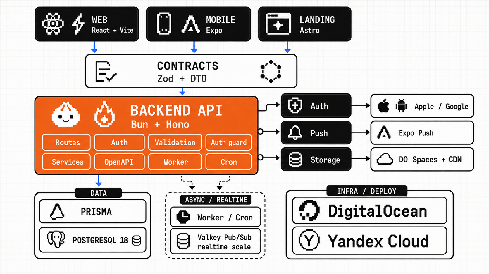

# Vibe Coding Template

<p align="center">
  
</p>

A web product template with a shared backend, built for work with AI coding agents. The `mobile` branch adds an Expo app with optional subscriptions, push notifications, and social sign-in.

## Prompt to copy to your agent

```text
Set up https://github.com/di-sukharev/vibe as the base for a new project.
Before cloning, ask whether mobile is needed: use the mobile branch for yes and master for no.
Read AGENTS.md and follow the "Agent setup instructions" section in README.md.
Communicate in my language.
```

## Agent setup instructions

[AGENTS.md](AGENTS.md) defines the working rules; [CLAUDE.md](CLAUDE.md) imports them. [.claude/settings.json](.claude/settings.json) and [.codex/rules/safety.rules](.codex/rules/safety.rules) block destructive git and Terraform commands for agents. Do not build features before setup is complete.

1. Before cloning, ask whether mobile is needed now. Select `mobile` or `master`.
2. For mobile, clone the full repository and fetch both branches. Run `git merge-base --is-ancestor origin/master origin/mobile`. If it fails, stop: the template owner must merge `master` into `mobile` first. Then switch to `mobile`.
3. Read the scripts and `.env.example` files of the selected applications. Complete [CHECKLIST.md](CHECKLIST.md) with the user, in the user's language: name and slug, active and deferred applications, features, and deployment scope. Make technical decisions yourself.
4. Treat setup as a new project unless the user explicitly asks to work on the template itself. For a new project, run `git remote remove origin`. Add a remote only from a user-provided address or a request to publish. Otherwise, report that publication is not configured. Never open a PR in the template repository during setup.
5. Configure only the selected applications. Keep the others, and record the reason for deferral in their README files. When an application becomes active, update that record, configure it, and verify it.
6. For web without mobile, do not configure Expo, EAS, or Maestro. In a new mobile project, select the Expo account and run EAS project init; do not set `expo.owner` or `extra.eas.projectId` in the template. Maestro needs an Expo development build; Expo Go is not enough.
7. Follow the [quick start](#quick-start). Create local `.env` files from the examples and generate `JWT_SECRET`. Never commit or print secrets. Cloud credentials are not needed without deployment.
8. Rename the project (below). Run focused checks. Delete the "New project setup" section and its markers from AGENTS.md. Report local URLs, commands, results, and the actions the user still needs to take.

### Rename the project

Search with `rg -n "web_app_demo|web-app-demo|vibecoding-template|Vibe Coding Template"`. Check packages, databases, cookies, Docker and Compose, images, and `webapp/index.html`. Make targeted edits. Regenerate `bun.lock` with the pinned Bun version and install. Check types, architecture, and backend integration for the selected applications.

### Hosting

Choose hosting in the «Деплой» (deployment) section of [CHECKLIST.md](CHECKLIST.md). In a new project, delete the unused provider's `infra/` directory and guide. Follow [DEPLOYMENT.md](docs/DEPLOYMENT.md) and the provider guide.

## Applications

| Path | Purpose | Guide |
| --- | --- | --- |
| `backend` | Bun/Hono API, Prisma/PostgreSQL, Zod, JWT, OpenAPI, jobs | [backend/README.md](backend/README.md) |
| `webapp` | React/Vite SPA after sign-in: accounts, admin, checkout | [webapp/README.md](webapp/README.md) |
| `website` | Astro public pages: landing, content, catalog, SEO | [website/README.md](website/README.md) |
| `packages/contracts` | Shared Zod schemas and API types | [packages/contracts/README.md](packages/contracts/README.md) |
| `mobile` branch | Expo app | [mobile/README.md](mobile/README.md) |

A marketplace usually needs both `website` and `webapp`. Keep SEO pages in `website` and signed-in screens in `webapp`. [WEB_SURFACES.md](docs/WEB_SURFACES.md) defines data, cart, checkout, and payment ownership.

## Quick start

From the repository root:

```bash
bun install --frozen-lockfile
```

Backend, sign-in, uploads, and database tests need [Docker Compose](docs/LOCAL_DATABASE.md). Website alone does not.

```bash
docker compose version
docker info
cp backend/.env.example backend/.env
docker compose --env-file backend/.env up -d --wait postgres
bun run --cwd backend prisma:deploy
bun run dev:seed
```

In PowerShell, use `Copy-Item backend/.env.example backend/.env`. If Docker fails, see [LOCAL_DATABASE.md](docs/LOCAL_DATABASE.md). Run PostgreSQL through Compose, not a native installation.

The seed creates public demo accounts from `DEV_SEED_*` in `backend/.env`. Never use them in production:

| Role | Email | Password | Page |
| --- | --- | --- | --- |
| Administrator | `admin@example.com` | `local-admin-password` | `/admin` |
| User | `user@example.com` | `local-user-password` | `/app` |

The seed is safe to repeat. It accepts only loopback databases and rejects `NODE_ENV=production`.

Start the applications you need, each in its own terminal:

```bash
bun run dev:backend
bun run dev:webapp
bun run dev:website
```

The browser origin must match `CORS_ORIGINS` in `backend/.env`; `http://localhost:5173` and `http://127.0.0.1:5173` are different origins. For a missing origin, `/api/auth/refresh` fails with `CORS Missing Allow Origin`: add the origin and restart the backend. To use another API address, set `VITE_API_URL` in `webapp/.env`. With several copies of the project, check which copy serves ports `3000` and `5173`.

## Checks

Agents pick focused checks by [AGENTS.md](AGENTS.md). The full `bun run check` needs Docker and package registry access. `bun run test:terraform` needs the Terraform CLI and runs separately.

## Documentation

| Topic | Guide |
| --- | --- |
| Commands | [COMMANDS.md](docs/COMMANDS.md) |
| Architecture, auth, Prisma | [ARCHITECTURE.md](docs/ARCHITECTURE.md) |
| UI patterns and screenshots | [UI.md](docs/UI.md) |
| Tests | [TESTING.md](docs/TESTING.md) |
| Apps, data, carts, checkout, payments | [WEB_SURFACES.md](docs/WEB_SURFACES.md) |
| Jobs and outbox | [BACKGROUND_JOBS.md](docs/BACKGROUND_JOBS.md) |
| Local PostgreSQL | [LOCAL_DATABASE.md](docs/LOCAL_DATABASE.md) |
| Files, email | [STORAGE.md](docs/STORAGE.md), [EMAIL.md](docs/EMAIL.md) |
| Deployment | [DEPLOYMENT.md](docs/DEPLOYMENT.md), [infra/README.md](infra/README.md) |

## License

Apache License 2.0. When you distribute a copy, fork, or derived project, keep [LICENSE](LICENSE) and [NOTICE](NOTICE). Preserve the attribution to Dima Sukharev, his GitHub account, and the source repository.
